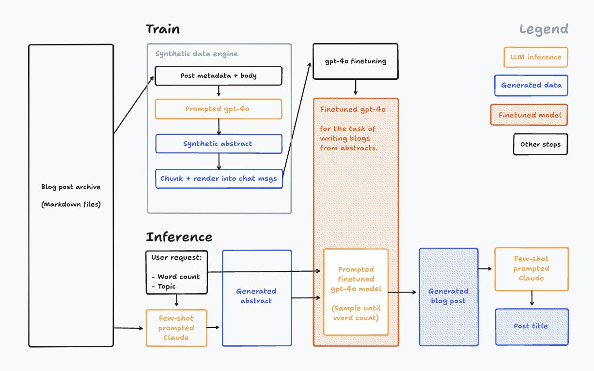

# ℹ️ Prompting

> “A large part of the difference between the experienced decision maker and the novice in these situations is <mark style="color:yellow;">not any particular intangible like judgment or intuition.</mark> If one could open the lid, so to speak, and see what was in the head of the experienced decision-maker, one would find that he had at his disposal repertoires of possible actions, that he had checklists of things to think about before he acted; and that he had <mark style="color:yellow;">mechanisms in his mind to evoke these, and bring these to his conscious attention</mark> when the situations for decisions arose.” - Farnam Street

### **Prompt Workflow:**

#### **1.  Do 3 scenarios manually**

Be aware exactly what is going on in your mind, are you maintaining a checklist of things, what are you searching for in the internet, what all are you trying to recall, do you have the urge to write a python script to do this instead? are you double checking something, what is the patterns you are going over various inputs, etc

#### **2.  Simulate: map manual process to AI metaphors:**

Inner Monologue, Internet Search, Knowledge Base, Code Generation, Image Search.

Prompt Topologies: Line (Chain), Star, Tree

#### **3.  Train the needed skill to AI:**

Consider your 6th standard cousin (basic logical, cognitive, creative skills, some coding and writing, small attention span) and estimate how much time would it take for them to learn the required skills.

Roughly, if you think you can teach them in 10 minutes, start with zero shot; if it takes couple practise exercises, few shot; If it takes one hour class, GPT-4, if it takes multiple days then fine tuning.

<figure><figcaption>
"Become one with the data - Andrej Karpathy"
</figcaption></figure>

#### **4.  Provide the needed knowledge to AI**

If the needed knowledge is under couple paragraphs, then in the prompt itself. If its more than couple pages, then Knowledge Base (RAG). Is that similar to open book exam, but still you first need to learn, then fine tuning + RAG.

#### **5.  Create test scenarios**

Couple for each rule, couple out of training examples and domains to check its generalisability, couple that violate input format and quality expectations. Ofc couple must work, ideal inputs.

#### **6.  Iterate**

"Show your prompt to a friend or colleague and ask them to follow the instructions themselves to see if they can produce the exact result you want." - tip from Anthropic

Try different models, go from single prompt to multiple, rephrase jobs of each prompt to popular versions, play with different personas for each prompt.

***

### Some tricks

Prompt Techniques -> are to hack the attention span/working memory

#### Proactive Correction:

If you can share feedback from compiler or schema validator to the LLM and ask it retry if failed, its great, but for qualitative generations which are user facing and high stakes, we won't know if that was good or worst: So, after generating, ask again: `you missed something, carefully check all my rules and correct please.` It doesn't have to specific feedback also, but does the trick.

#### **Examples in Few Shot:**

Diverse\
Easy to Hard Order\
Cover all strict rules\
(if you can, give as many less examples as possible, ideal is zero)

#### **Format in Generation:**

Skeleton or Schema in System Instruction\
Not necessary to provide example unless the schema is not popular.

#### **Text Rephrase:**

Aspects to rephrase\
What not to ignore\
What to feel free with

#### **Chain of Thought**

Do not jump to conclusion and loosely some rationality thinking process/framework like OODA (Observe, Decide, Act). If latency is constraint, then CoT can also be like pseudo code with just keywords.

***

### TODO:

Thinking about Single Prompts

Analogy: an average person with short attention span/working memory and no long term memory

Baseline: direct task, few examples

Indirect task that LLM might be familiar with

Simulating Attention Patterns explicitly: Case study: reversing word

XY Problem\

**In-context learning vs Fine-tuning learning:**

Teach hard/Rare latent space attention patterns

Progressively remove CoT/Inner monologue

**When we will move from single prompt, that does everything**

Latency by Parallelization

Working memory limit

Task global context hurting sub parts

\

**When not to split**

When we can’t split the task -> tightly coupled context

What to do when we can’t split, but current sota model is not capable yet

**What to consider when splitting**

Errors cascading or even compounding

Design to accept inputs flexibly, but output predictably ([robustness](https://arc.net/l/quote/garizcod))

Common prompt topologies (Star, Chain, Tree, 1-1)

**Tools**

Letting Prompts Take Actions

Giving Prompts Long term memory Remembering

Internet Search&#x20;

\

**Testing**

Log losses

Lower models, to see what instructions were very hard or over learnt

—-

**Case studies:**

Form Roast Architecture Decisions:

* Zero shot vision prompt as base
* Separate Prompt for each feedback category
* Separate prompt to format output, same for all feedback categories
* Final single prompt that will generate overall summary

Conversations to Distrubutions/Insights Architecture Decisions:

* Pandas tool use to count accurately
* LLMs to look at the data in sliding windows multiple times

—-----

Meta:

* How to effectively transfer tacit knowledge?

Now explore:

* Look at sensitivity of different prompt/models with [Function Calling Benchmark & Testing](https://github.com/ComposioHQ/Composio-Function-Calling-Benchmark) by Composio.dev
* Iterating through in-context, RAG and finetuning, synthetic data generation for [Vulnerability Fixing via LLMs by Patched.codes](https://www.patched.codes/blog/the-static-analysis-evaluation-benchmark-measuring-llm-performance-in-fixing-software-vulnerabilities)
* Carefully designing the context and setting evaluation metric via [Github Copilot Reverse Engineered](https://thakkarparth007.github.io/copilot-explorer/posts/copilot-internals.html)
* [Multi-prompt architecture for synthetic data generation](https://www.syntheticusers.com/science-posts/synthetic-users-system-architecture-the-simplified-version)

<figure><figcaption>
syntheticusers.com
</figcaption></figure>

*   Everything is remix, this is also from [Knowledge Engineering](https://commonkads.org/introduction/)

    <figure><figcaption></figcaption></figure>
