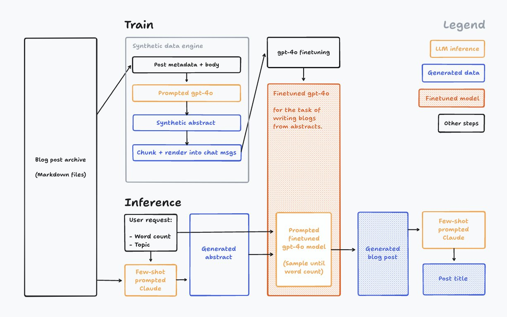

# 🔮 Design for AI

### Interfaces



#### knowledge [graphs](https://instagraph.ai/graph/PLVO2aNOFeasiCBQYUpnQIVA3D62/l2LB1oDcX4dkjkLpw4BF)



#### generative UIs for showing information



just in time UIs for interacting



Discovery Maps



### Interactions

#### Pinch to summarize:



#### circle to search



#### draw to edit images



#### Pick to rephrase:



### Opinions:

By thesephist:



[AI Solutions as a Feature, Platform and Person](https://university.obvious.in/working-with-features/building-with-ai/map-your-product) by Obvious.in University

<figure><figcaption>
<a href="https://university.obvious.in/working-with-features/building-with-ai/llm-inputs">https://university.obvious.in/working-with-features/building-with-ai/llm-inputs</a>
</figcaption></figure>

